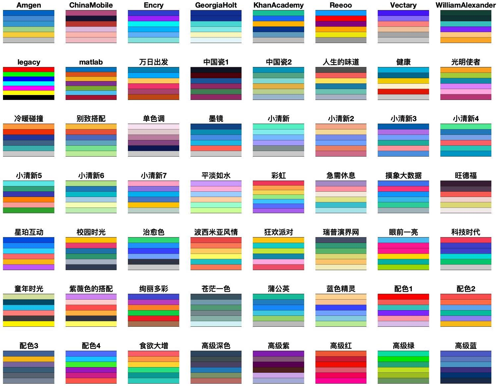
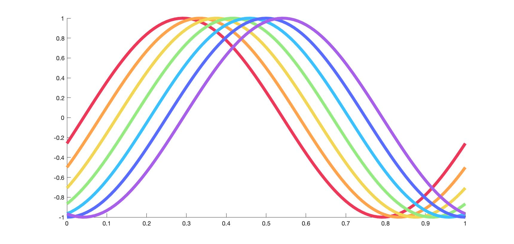
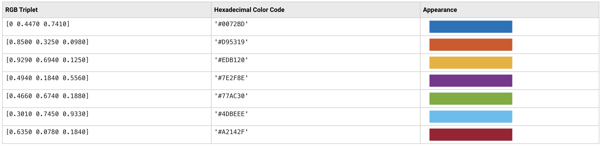
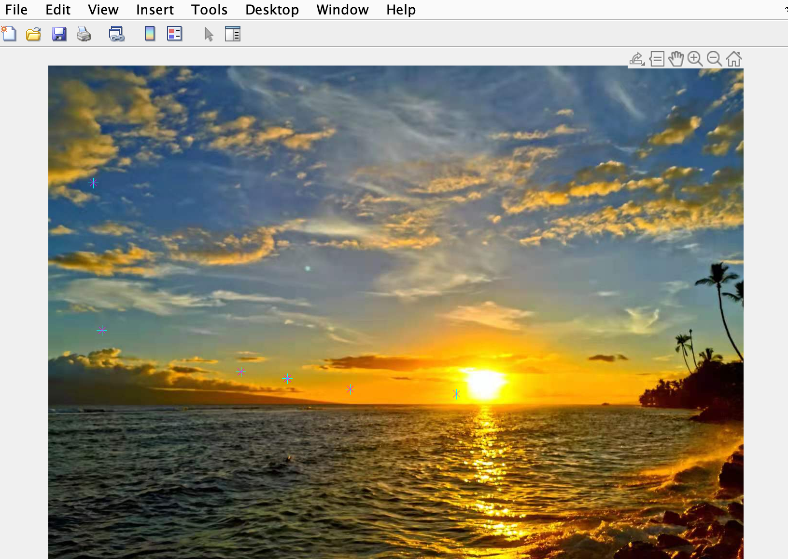

# MatLab自定义配色方案库 jlcolor

## 缘起

在使用MatLab绘图时有时会对MatLab默认的配色方案不太满意，平时遇到好看的配色方案也会想要保存下来自己用。但是之前保存的MatLab使用笔记过于凌乱，想要用某个配色时不太好找，所以就有了自制一个配色方案库的想法，以便可以随时保存好看的配色方案，在绘图时也可以很方便地预览和调用。

## 功能

- 预览某个配色方案，或预览所有配色方案
- 调用配色方案
- 自定义并保存配色方案
- 从图片提取颜色定义配色方案

## 前提

- MatLab版本号高于2021a
    
    可选。`jlShowColor.m`中使用了`tiledlayout()`函数，这个函数是在2021a版本引入MatLab的。如果MatLab版本低于2021a，可修改`jlShowColor.m`文件，将使用的`tiledlayout()`函数改为`subplot()`等功能相似的函数。
- [图像处理工具箱](https://www.mathworks.com/products/image.html?s_tid=AO_PR_info) （[Image Processing Toolbox](https://www.mathworks.com/products/image.html?s_tid=AO_PR_info)）

    可选。如果需要使用从图片上提取颜色自制配色方案的话就需要在MatLab内安装此工具箱。

## 下载安装

1. MatLab默认将用户自定义的脚本、函数工具等放在`~/Documents/MATLAB`文件夹下，这里建议将本绘图方案库也放在此文件夹下：
    ```bash
    git clone https://github.com/jin-li/jlcolor.git ~/Documents/MATLAB/jlcolor
    ```
1. 然后将本绘图方案库所在的目录加入到MATLAB的搜索路径中。
    
    
    也可通过命令搞定。打开MatLab，在命令窗口运行如下命令：
    - Windows用户
        ```matlab
        addpath([getenv('USERPROFILE'),'\Documents\MATLAB\jlcolor']);
        savepath;
        ```
    - Linux或macOS用户
        ```matlab
        addpath([getenv('HOME'),'\Documents\MATLAB\jlcolor']);
        savepath;
        ```
## 工具简介

- **预览配色方案**
    - 打开MatLab，在命令窗口输入如下命令可预览目前库中所有配色方案：
        ```matlab
        jlShowColor('all')
        ```
        库中的配色方案和它们的名字将会展示出来：
        
    - 也可预览单个配色方案，例如预览名为“彩虹”的配色方案，就可以在命令窗口运行如下命令：
        ```matlab
        jlShowColor('彩虹')
        ```

- **调用配色方案**
    1. 使用`jlGetColor()`函数可以方便地调用本配色方案库中储存的配色方案，例如
        ```matlab
        c = jlGetColor('彩虹')
        ```
        就可以将“彩虹”配色方案中的7种颜色调出到变量`c`中了。
    1. 然后将可以在绘图时方便地使用这7种颜色啦，例如
        ```matlab
        c = jlGetColor('彩虹'); % 获取配色
        figure; hold on;
        x=0:0.01:1;
        for i=1:length(c)
            plot(x,sin(2*pi*x-pi*i/12),'color',c(i),'linewidth',5);
        end
        ```
        效果如下图：
        


- **自定义并保存配色方案**
    
    - 本配色方案库中各个配色方案保存在`jlColorLib.m`中，用户可以手动往`jlColorLib.m`文件中添加配色方案。例如MatLab中默认的几种配色如下：
    
    用户可以将这7种颜色的十六进制码按照`jlColorLib.m`中已有配色方案的写法添加进去，即在`jlColorLib.m`文件中添加一行
        ```matlab
        jlColor('matlab') = ['#0072BD';'#D95319';'#EDB120';'#7E2F8E';'#77AC30';'#4DBEEE';'#A2142F'];
        ```
        MatLab中的默认配色方案就以"matlab"为名保存在配色方案库中了。

    - 也可以使用`jlAddColor()`函数来添加配色方案。直接在MatLab命令窗口运行下面两行代码：
        ```matlab
        colors = ["#0072BD","#D95319","#EDB120","#7E2F8E","#77AC30","#4DBEEE","#A2142F"];
        jlAddColor(colors, "matlab");
        ```

- **从图片中提取颜色自制配色方案**

    使用库中提供的`jlAddColorFromImage()`可以方便地从一张图片中提取想要的颜色来生成自己的配色方案。例如上面使用的“彩虹”配色和库中的“落日余晖”配色都是根据图片生成的。准备好需要的图片文件`sunset.jpeg`，在Matlab命令窗口中输入下面的代码：
    ```matlab
    jlAddColorFromImage('sunset.jpeg','落日余晖');
    ```
    然后MatLab就会弹出下图所示的窗口，用鼠标在图片上连续点取所需的颜色即可，选完按回车键结束，就会弹出另一个窗口来展示已成功地创建了这个配色方案！
    

## 鸣谢

- 本库中使用的RGB转十六进制的函数来自MathWorks社区用户[Chad Greene](https://www.mathworks.com/matlabcentral/profile/authors/1062128)上传的[脚本](https://www.mathworks.com/matlabcentral/fileexchange/46289-rgb2hex-and-hex2rgb)。
- 本库中部分配色方案取自知乎用户[CoderMan](https://www.zhihu.com/people/1105936347)发布的知乎专栏文章[【2.1.1 颜色模板】科研绘图必备的60套颜色模板](https://zhuanlan.zhihu.com/p/488125051)中提到的配色方案。